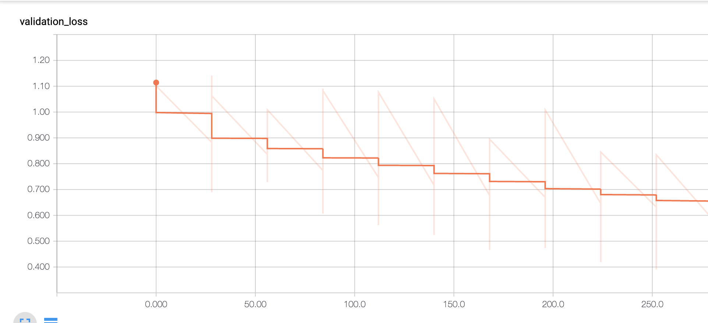
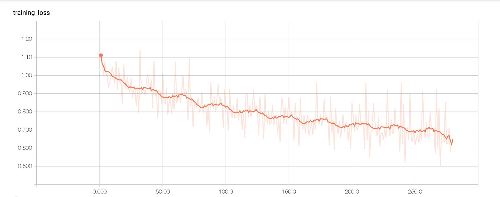
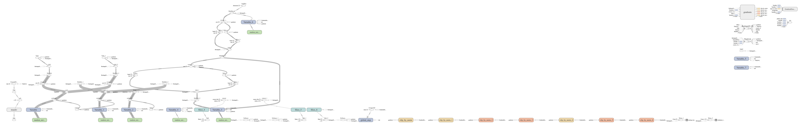

# Aspect-Level-Sentiment-Analysis
Performed Aspect Level Sentiment Analysis using a Deep Memory Network. It explicitly captures the importance of each context word when inferring the sentiment polarity of an aspect word.


### Install
#### If you are using virtualenv
```bash
virtualenv env
``` 

```bash
source env/bin/activate
``` 

```bash
pip install -r requirements.txt
``` 
#### Else

```bash
pip install -r requirements.txt
``` 

### Data

Download the Gloves pretrained embeddings and store it in the `/data` folder from https://www.kaggle.com/thanakomsn/glove6b300dtxt/download

### Run

```bash
python main2.py
```  

This will start the training process.

### Accuracy
#### Training

#### Validation


### Tensorboard Graph Visualization



